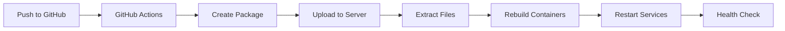

# Automatic Deployment Setup

This guide explains how to set up automatic deployment from GitHub to your server at **192.168.2.118**.

## 🎯 Overview

Every time you push code to the `main` branch on GitHub, it will automatically:
1. Build a deployment package
2. Upload it to your server
3. Rebuild Docker containers
4. Restart all services

---

## 📋 Prerequisites

- GitHub repository for ChainViz
- Server access (192.168.2.118)
- Server credentials (username: chainviz, password: chainviz)

---

## 🔧 Setup Instructions

### Step 1: Configure GitHub Secrets

You need to add secrets to your GitHub repository so the deployment workflow can access your server.

1. Go to your GitHub repository
2. Click **Settings** → **Secrets and variables** → **Actions**
3. Click **New repository secret** and add these secrets:

| Secret Name | Value | Description |
|------------|-------|-------------|
| `SERVER_HOST` | `192.168.2.118` | Your server IP address |
| `SERVER_USER` | `chainviz` | SSH username |
| `SERVER_PASSWORD` | `chainviz` | SSH password |

**How to add a secret:**
- Click "New repository secret"
- Enter the **Name** (e.g., `SERVER_HOST`)
- Enter the **Value** (e.g., `192.168.2.118`)
- Click "Add secret"

Repeat for all three secrets.

---

### Step 2: Push the Workflow File

The workflow file is already created at `.github/workflows/deploy.yml`. You just need to commit and push it:

```bash
cd /Users/t/Documents/vibbbing/ChainViz
git add .github/workflows/deploy.yml
git add AUTO_DEPLOY_SETUP.md
git commit -m "Add automatic deployment workflow"
git push origin main
```

---

### Step 3: Verify Deployment

After pushing, the deployment will automatically start.

**Check deployment status:**
1. Go to your GitHub repository
2. Click the **Actions** tab
3. You should see a workflow run called "Deploy to Server"
4. Click on it to see real-time logs

**Successful deployment shows:**
- ✅ Checkout code
- ✅ Deploy to server
- ✅ Service status output
- ✅ Health check passed

---

## 🚀 How It Works

### Trigger Events

The deployment runs automatically when:
1. **Push to main branch** - Any commit pushed to `main` triggers deployment
2. **Manual trigger** - You can manually trigger from GitHub Actions tab

### Deployment Process



1. **Package Creation**: Creates a tarball excluding unnecessary files
2. **Upload**: Uses `sshpass` to securely upload to server
3. **Extraction**: Extracts files to temporary location
4. **Sync**: Updates deployment directory, preserving `.env`
5. **Docker Rebuild**: Rebuilds containers with new code
6. **Restart**: Restarts all services
7. **Health Check**: Verifies backend is responding

---

## 📊 Monitoring Deployments

### View Deployment Logs

**In GitHub:**
- Actions tab → Select workflow run → View logs

**On Server:**
```bash
ssh chainviz@192.168.2.118
cd ~/ChainViz
sudo docker compose logs -f
```

### Check Service Status

```bash
ssh chainviz@192.168.2.118
cd ~/ChainViz
sudo docker compose ps
```

### Test Health

```bash
curl http://192.168.2.118:8000/health
```

Expected response: `{"status":"healthy"}`

---

## 🛠️ Manual Deployment

If you need to deploy manually without pushing to GitHub:

### Option 1: Trigger from GitHub

1. Go to **Actions** tab
2. Click **Deploy to Server** workflow
3. Click **Run workflow** button
4. Select `main` branch
5. Click **Run workflow**

### Option 2: Deploy from Local Machine

```bash
cd /Users/t/Documents/vibbbing/ChainViz
./deployment/deploy-ssh.sh 192.168.2.118 chainviz
```

---

## 🔒 Security Considerations

### Current Setup (Password Authentication)

**Pros:**
- Simple to set up
- Works immediately

**Cons:**
- Password stored in GitHub secrets
- Less secure than SSH keys

### Recommended: SSH Key Authentication

For better security, switch to SSH key authentication:

```bash
# 1. Generate SSH key on your local machine
ssh-keygen -t ed25519 -C "github-actions-chainviz" -f ~/.ssh/chainviz-deploy

# 2. Copy public key to server
sshpass -p 'chainviz' ssh-copy-id -i ~/.ssh/chainviz-deploy.pub chainviz@192.168.2.118

# 3. Update GitHub Secret
# Replace SERVER_PASSWORD with SSH_PRIVATE_KEY
# Content: Paste the contents of ~/.ssh/chainviz-deploy (private key)
```

Then update `.github/workflows/deploy.yml` to use SSH keys instead of password.

---

## 🐛 Troubleshooting

### Deployment Fails

**Check GitHub Actions logs:**
1. Go to Actions tab
2. Click on failed workflow
3. Expand each step to see error messages

**Common issues:**

| Error | Solution |
|-------|----------|
| "Permission denied" | Verify `SERVER_PASSWORD` secret is correct |
| "Connection refused" | Check server is online: `ping 192.168.2.118` |
| "Docker command failed" | SSH to server and check Docker status |
| "Port already in use" | Restart server or stop conflicting service |

### Services Won't Start

```bash
# SSH to server
ssh chainviz@192.168.2.118
cd ~/ChainViz

# Check what's wrong
sudo docker compose logs

# Restart services
sudo docker compose down
sudo docker compose up -d --build

# Check status
sudo docker compose ps
```

### Rollback to Previous Version

```bash
# SSH to server
ssh chainviz@192.168.2.118
cd ~/ChainViz

# Check git history (if using git on server)
git log --oneline -10

# Rollback to specific commit
git checkout <commit-hash>
sudo docker compose down
sudo docker compose up -d --build
```

---

## 📝 Deployment Checklist

Before each deployment, ensure:

- [ ] Code is tested locally
- [ ] All tests pass
- [ ] Docker builds successfully locally
- [ ] Environment variables are documented
- [ ] Breaking changes are documented
- [ ] Database migrations (if any) are handled

After deployment:

- [ ] Check GitHub Actions completed successfully
- [ ] Verify services are running: `sudo docker compose ps`
- [ ] Test health endpoint: `curl http://192.168.2.118:8000/health`
- [ ] Test frontend: Open http://192.168.2.118 in browser
- [ ] Check logs for errors: `sudo docker compose logs --tail=50`

---

## 🔄 Workflow Customization

### Deploy to Different Branch

Edit `.github/workflows/deploy.yml`:

```yaml
on:
  push:
    branches:
      - main
      - staging  # Add staging branch
```

### Deploy Only Specific Files

Modify the workflow to deploy only when certain files change:

```yaml
on:
  push:
    branches:
      - main
    paths:
      - 'backend/**'
      - 'frontend/**'
      - 'docker-compose.yml'
```

### Add Slack Notifications

Add notification step to workflow:

```yaml
- name: Notify on Slack
  if: always()
  uses: 8398a7/action-slack@v3
  with:
    status: ${{ job.status }}
    webhook_url: ${{ secrets.SLACK_WEBHOOK }}
```

---

## 📈 Advanced: Blue-Green Deployment

For zero-downtime deployments:

1. **Build new containers** with different names
2. **Test new containers** before switching
3. **Switch traffic** using Nginx
4. **Remove old containers** after verification

This requires additional setup - see `ADVANCED_DEPLOYMENT.md` (coming soon).

---

## 🎉 Success!

Your automatic deployment is now configured! Every push to `main` will automatically deploy to your server.

**Test it:**
1. Make a small change (e.g., update README)
2. Commit and push to main
3. Watch GitHub Actions deploy it
4. Visit http://192.168.2.118 to see the change

---

## 📞 Support

If you encounter issues:
1. Check GitHub Actions logs
2. Check server logs: `sudo docker compose logs`
3. Verify secrets are correctly configured
4. Ensure server is accessible from internet

---

## 🔗 Quick Links

- **Frontend**: http://192.168.2.118
- **API**: http://192.168.2.118:8000
- **API Docs**: http://192.168.2.118:8000/docs
- **Health**: http://192.168.2.118:8000/health
- **GitHub Actions**: `https://github.com/YOUR_USERNAME/ChainViz/actions`

---

**Happy deploying! 🚀**
